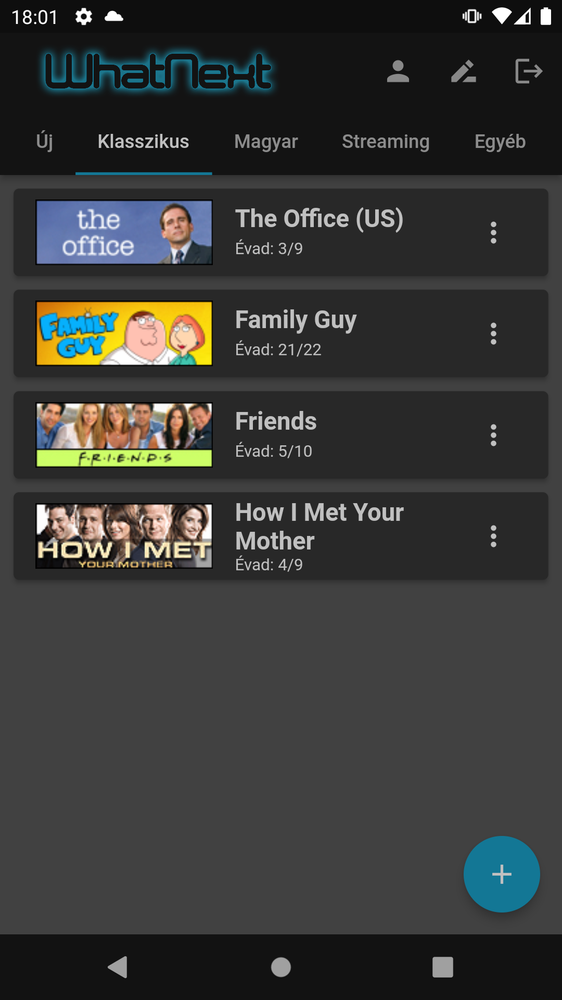
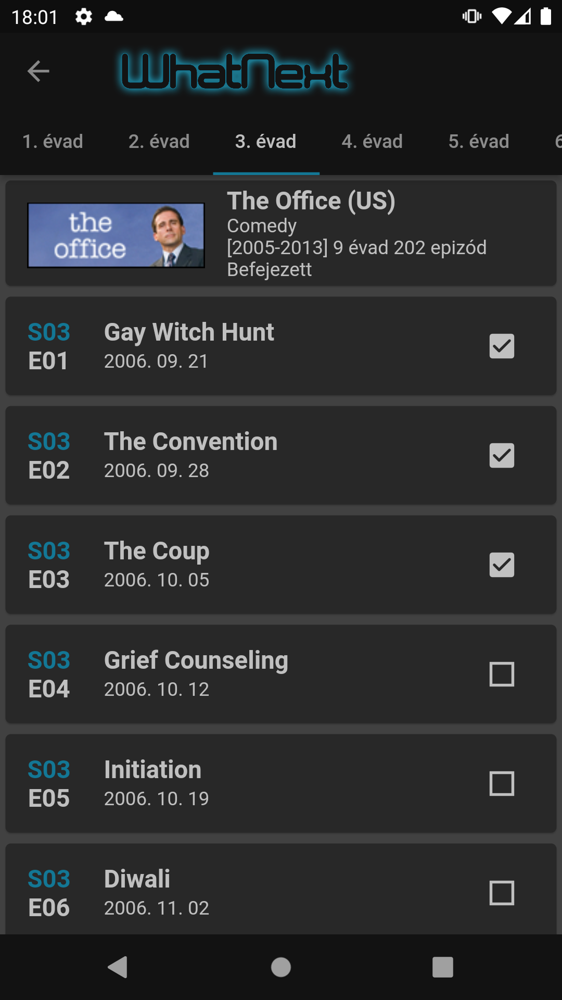
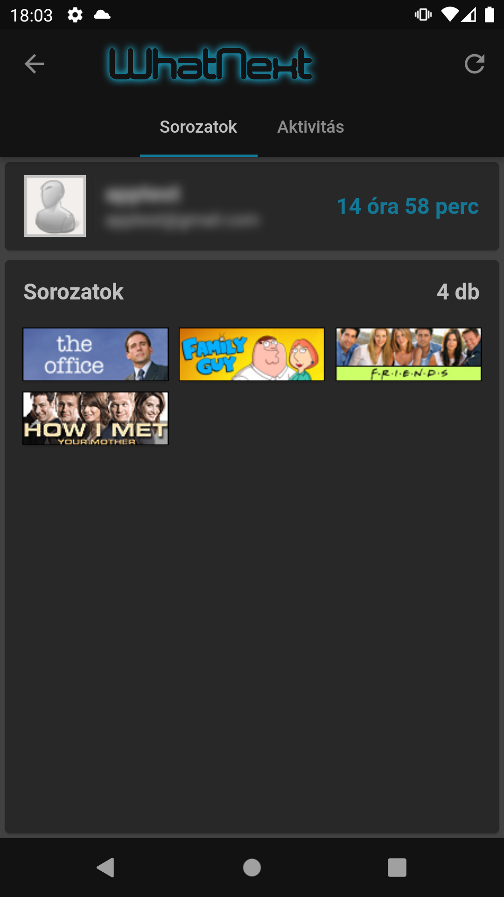
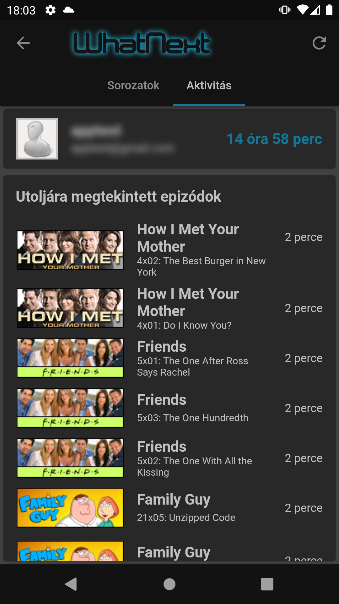
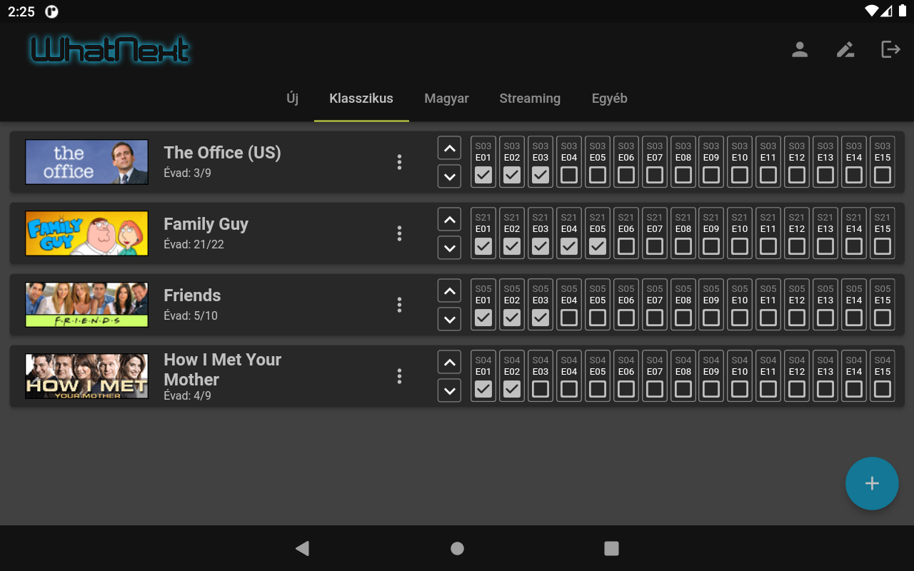

# WhatNext Application

Follow your favorite series on your mobile!

This app is the phone app of the popular series tracking website WhatNext ([https://whatnext.cc](https://whatnext.cc)).

## Screenshots

### Mobile

  
  
  
  

### Tablet

  

## Important Notes

The mobile application currently provides a limited subset of the features available on the main WhatNext website. Because of this, first-time users should visit the website and create their account there before using the mobile app: [https://whatnext.cc](https://whatnext.cc)

If you would like to request a new feature, please open an Issue in this repository. Contributions are also welcome, feel free to suggest improvements or implement features through Pull Requests by following the guidelines described in the [`CONTRIBUTING`](CONTRIBUTING.md) documentation.

## Disclaimer

The WhatNext Application (referred to as "the Application") is our only product, and we strive to ensure its quality and reliability. However, please note that we are not responsible for the content, functionality, or availability of the website https://whatnext.cc (referred to as "the Website"), which may be accessed or used through the Application. The inclusion of a link or reference to the Website does not imply our endorsement or approval of its content or practices. Users are advised to review the terms and conditions and privacy policies of the Website. We disclaim any liability for any damages or losses incurred from the use of the Website. If you encounter any issues with the Website, you can find more information at https://whatnext.cc/impresszum.

Furthermore, please note that the Application is shared with the approval of the Website owner (JohnHU).
